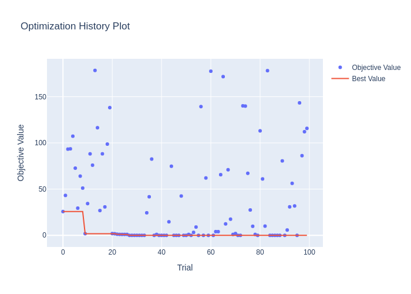

## Class or Function Names

- SAMCSampler

## Installation

```bash
pip install -r https://hub.optuna.org/samplers/smac_sampler/requirements.txt
```

## Example

```python
search_space = {
    "x": FloatDistribution(-10, 10),
    "y": IntDistribution(0, 10),

}
sampler = SMACSampler(search_space)
study = optuna.create_study(sampler=sampler)
```

See [`example.py`](https://github.com/optuna/optunahub-registry/blob/main/package/samplers/hebo/example.py) for a full example.


## Others

SMAC is maintained by the SMAC team in [automl.org](https://www.automl.org/). If you have trouble using SMAC, a concrete question or found a bug, please create an issue under the [SMAC](https://github.com/automl/SMAC3) repository.

For all other inquiries, please write an email to smac\[at\]ai\[dot\]uni\[dash\]hannover\[dot\]de.

### Reference

Lindauer et al. "SMAC3: A Versatile Bayesian Optimization Package for Hyperparameter Optimization", Journal of Machine Learning Research, http://jmlr.org/papers/v23/21-0888.html
